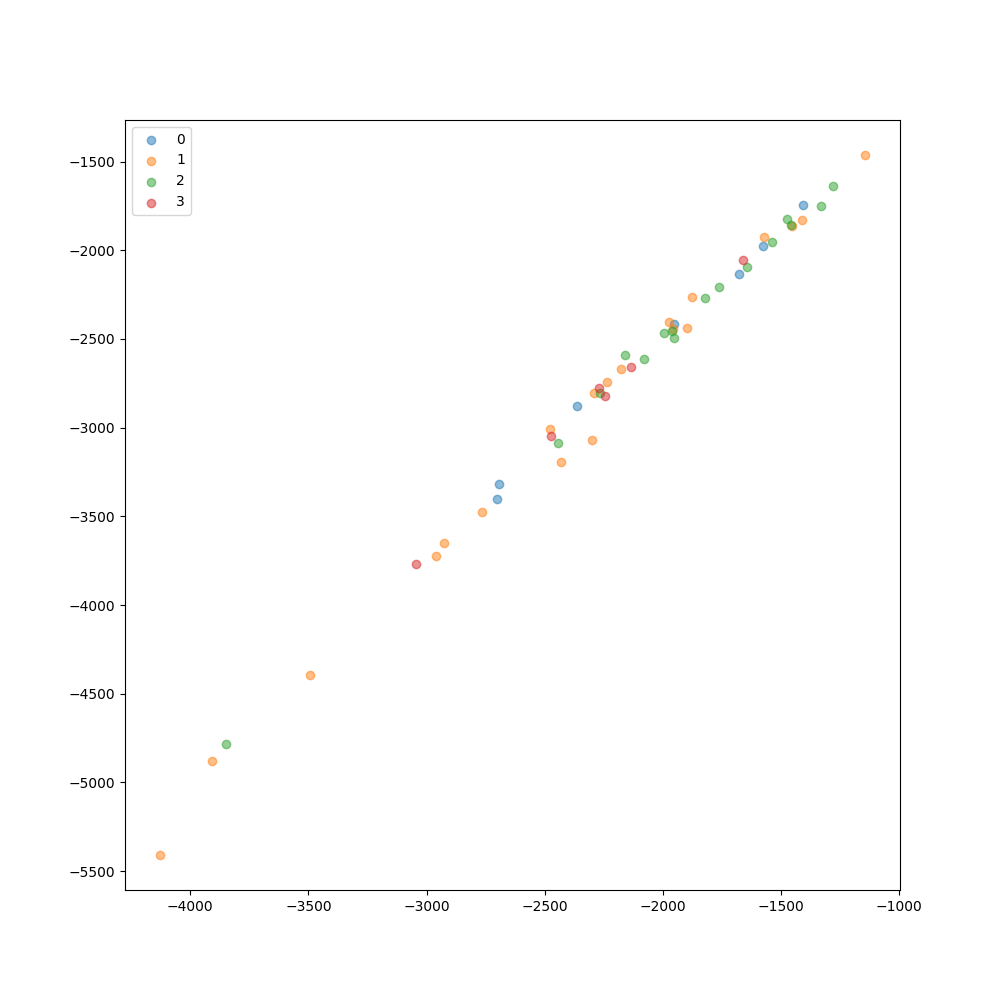
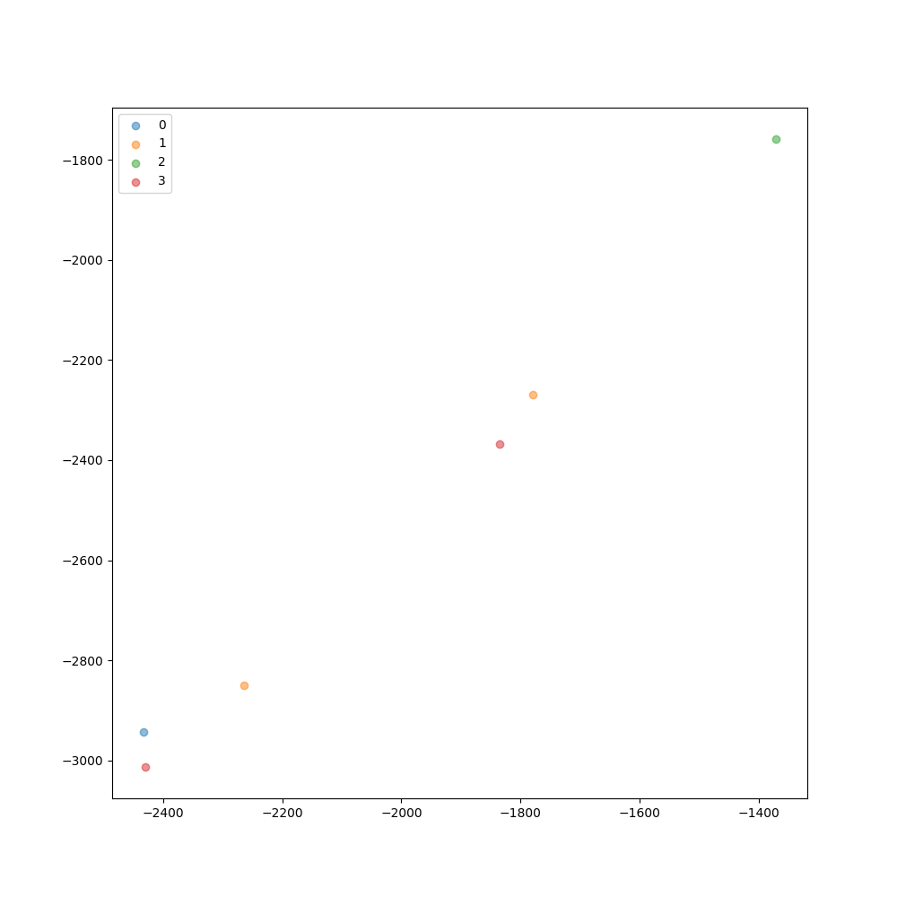
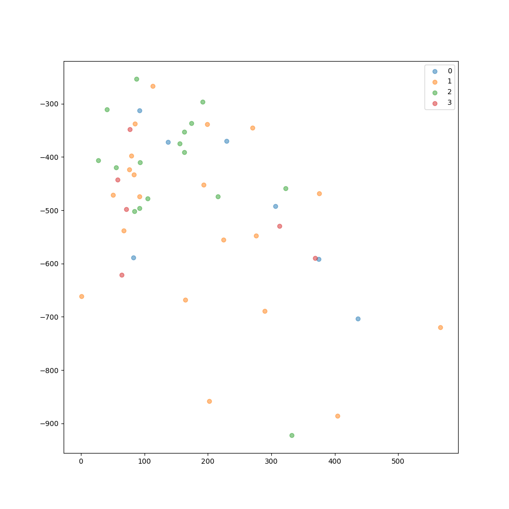
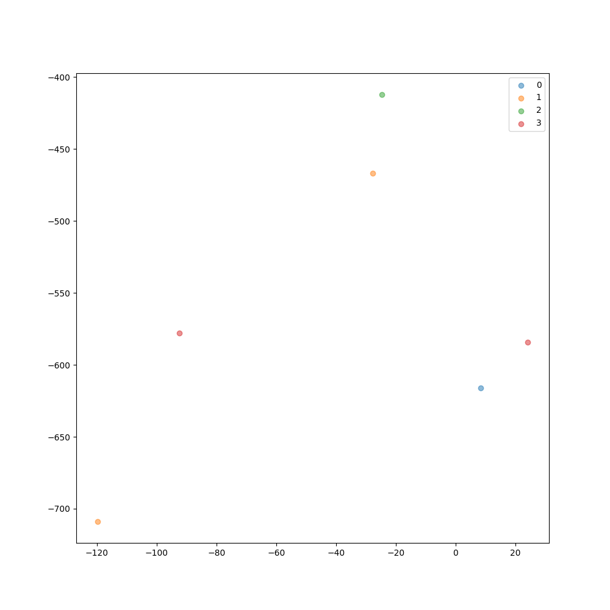
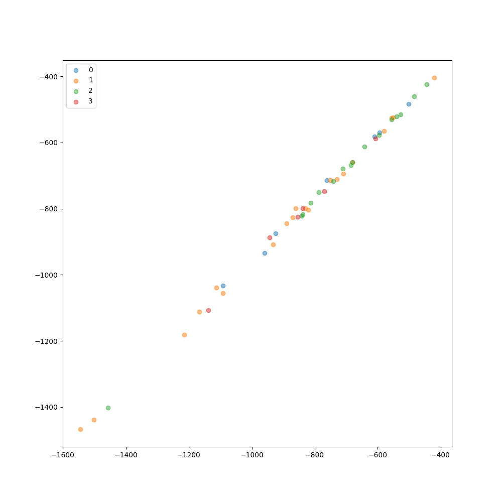
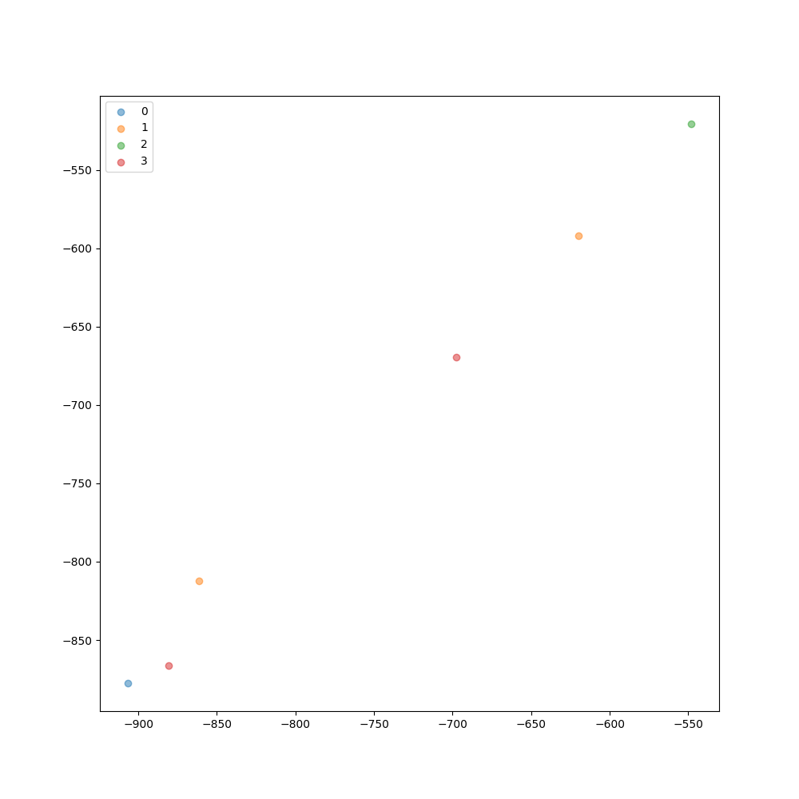
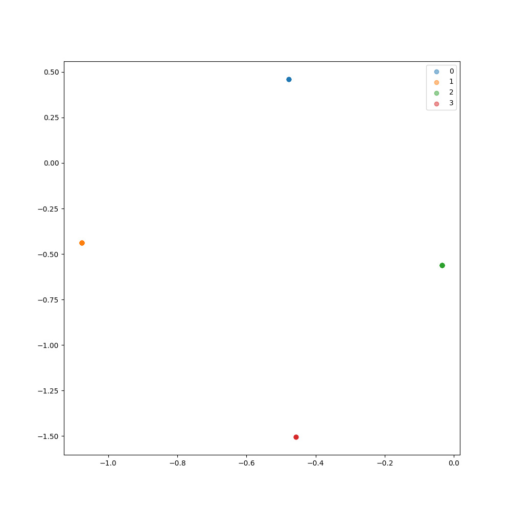
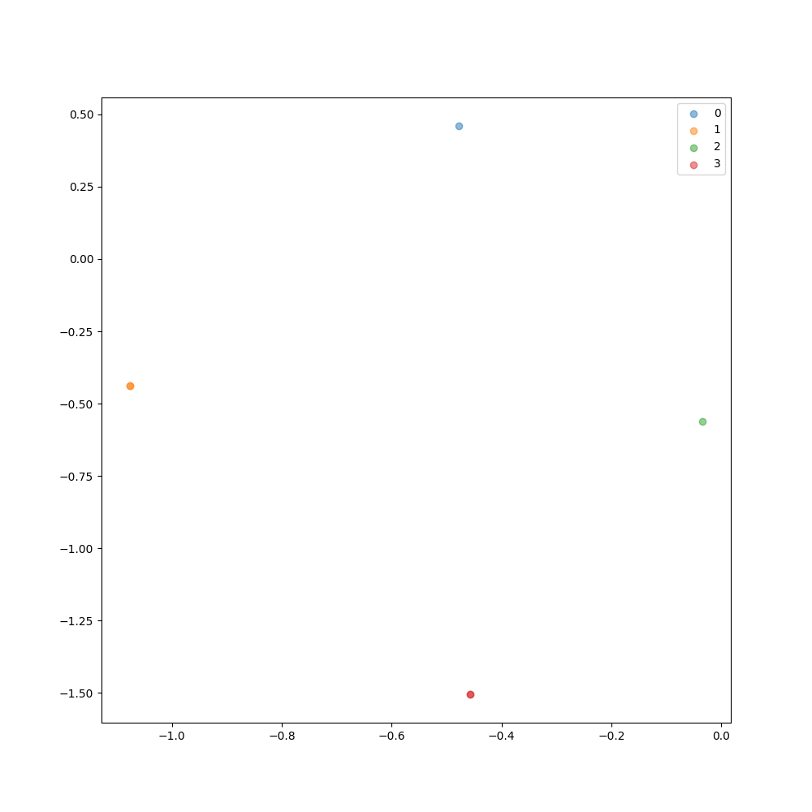

# Решение тестового задания по тестированию тройной функции потерь

Описание тестового задания:   
1. Есть код на гите https://github.com/ikonushok/siamese-triplet  
2. Есть статья к коду https://arxiv.org/pdf/1503.03832.pdf   
3. Надо прочитать и рассказать, что нового предлагается в подходе, кроме обычного one-shot learning   
4. Нарисовать блок схемы формирования триплетов для вариантов 3,4,5 вариантов кода   
5. К этому коду есть датасет. Необходимо запустить код  на этом датасете. В датасете дано 4 класса   
то есть, 2 класса buy и 2 класса sell (их нужно обьединить в один датасет с 4мя классами [0, 1, 2, 3])

# Решение

- **Решение задачи Степанов.docx** - решение задания по пункту 3.
- **Блоксхемы в формате Miceosoft Visio** - решение задания по пункту 4.
  - *OnlineContrastiveLoss.vsdx*
  - *OnlineTripletLoss.vsdx*
  - *TripletLoss.vsdx*
- **task_stepanov.py** - решение задания по пункту 5. Для разработки использовался Jupyter Notebook (task_stepanov.ipynb). Графики результатов сохраняются в "/pic_result"

# Результаты

Ниже приведены результаты работы скрипта по п.5

## Baseline - classification

Train:

Test:

## Siamese network

Train:

Test:

## Triplet network

Train:

Test:

## Online pair selection

Train:

Test:

## Online triplet selection

Train:

Test:
